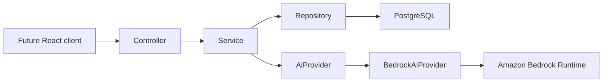

# DayLog Backend

DayLog is a personal daily timeline backend. It stores manual activities and meaningful location events, then provides grounded AI explanations and questions about a recorded day.

## Architecture



The backend is a single Spring Boot application with a simple Controller → Service → Repository structure. DTOs are used at every controller boundary; JPA entities are not returned directly.

## Technologies

- Java 22 source/target configuration
- Spring Boot 3.5
- Spring Web, Spring Data JPA, Spring Security
- PostgreSQL
- Maven
- JWT authentication with BCrypt password hashing
- AWS SDK for Java 2.x, Amazon Bedrock Runtime

## Data model

- `app_users`: account name, unique email, BCrypt password hash, creation time
- `places`: a user's saved location with latitude, longitude, and radius
- `day_events`: a user's chronological activity or location event, optionally linked to a saved place

Event enums:

- `eventType`: `LOCATION`, `ACTIVITY`
- `source`: `AUTOMATIC`, `MANUAL`
- `category`: `PERSONAL`, `STUDY`, `WORK`, `HEALTH`, `SOCIAL`, `OTHER`

## API

All protected endpoints require:

```http
Authorization: Bearer <jwt>
```

### Authentication

| Method | Path | Purpose |
| --- | --- | --- |
| POST | `/api/auth/register` | Create an account and return a JWT |
| POST | `/api/auth/login` | Authenticate and return a JWT |
| POST | `/api/auth/logout` | Return a logout acknowledgement; the client discards its JWT |

### Places

| Method | Path | Purpose |
| --- | --- | --- |
| POST | `/api/places` | Create a saved place |
| GET | `/api/places` | List only the authenticated user's places |
| DELETE | `/api/places/{id}` | Delete one of the authenticated user's places |

### Events

| Method | Path | Purpose |
| --- | --- | --- |
| POST | `/api/events` | Create an activity or location event |
| GET | `/api/events?date=YYYY-MM-DD` | Return that user's events in chronological order |
| DELETE | `/api/events/{id}` | Delete one of the authenticated user's events |
| POST | `/api/events/demo-location` | Create an automatic arrive/leave location event through the normal event pipeline |

Location events must reference a saved place. Activity events must include a category. Demo events accept `ARRIVE` or `LEAVE` and are stored as `AUTOMATIC`.

### AI

| Method | Path | Purpose |
| --- | --- | --- |
| POST | `/api/ai/explain-day` | Return a structured, event-grounded daily insight |
| POST | `/api/ai/ask` | Answer a question using only that day's recorded events |

Example Ask My Day request:

```json
{
  "date": "2026-09-19",
  "question": "Where did I spend most of my recorded day?"
}
```

If Bedrock is not configured, AI endpoints return `503` with a clear configuration error. AI provider failures return `502`.

## Environment variables

Copy `.env.example` as a reference. Do not commit a real `.env` file.

| Variable | Required | Description |
| --- | --- | --- |
| `DATABASE_URL` | Yes | JDBC PostgreSQL URL or `postgresql://...` connection URL |
| `DATABASE_USERNAME` | No | Database username when not embedded in the URL |
| `DATABASE_PASSWORD` | No | Database password when not embedded in the URL |
| `JWT_SECRET` | Yes | Secret used to derive the JWT signing key |
| `JWT_EXPIRATION_MS` | No | JWT lifetime; defaults to 24 hours |
| `FRONTEND_ORIGIN` | No | Comma-separated allowed browser origins; defaults to `http://localhost:5173` |
| `AWS_REGION` | For AI | Bedrock region |
| `AWS_ACCESS_KEY_ID` | For AI | AWS credential from a secret |
| `AWS_SECRET_ACCESS_KEY` | For AI | AWS credential from a secret |
| `BEDROCK_MODEL_ID` | For AI | Bedrock foundation model ID |

AWS credentials are never sent to the client and are never hardcoded. The Bedrock provider only creates a client after all required AI configuration is present.

## Local setup

1. Install Java 22 and Maven.
2. Create a PostgreSQL database named `daylog`.
3. Set `DATABASE_URL`, `DATABASE_USERNAME`, `DATABASE_PASSWORD`, and `JWT_SECRET` through environment variables or Replit Secrets.
4. Add the Bedrock variables only when AI features are needed.
5. Run:

```bash
mvn spring-boot:run
```

The application listens on port `8080` by default. Hibernate creates/updates the MVP tables with `spring.jpa.hibernate.ddl-auto=update`.

For a build:

```bash
mvn package
```

For tests, the suite uses an in-memory H2 database and mocks `AiProvider`; it does not require AWS credentials or a live Bedrock call.

## Security and privacy

- Passwords are stored only as BCrypt hashes.
- Every place, event, and AI query is scoped to the authenticated user from the JWT.
- Client-supplied user IDs are not accepted for user-owned operations.
- CORS origins are configurable and credentials are not enabled for cross-origin requests.
- AI prompts contain only the authenticated user's requested-day events.
- AI instructions explicitly forbid invented details and require an absence response when the event data does not contain an answer.